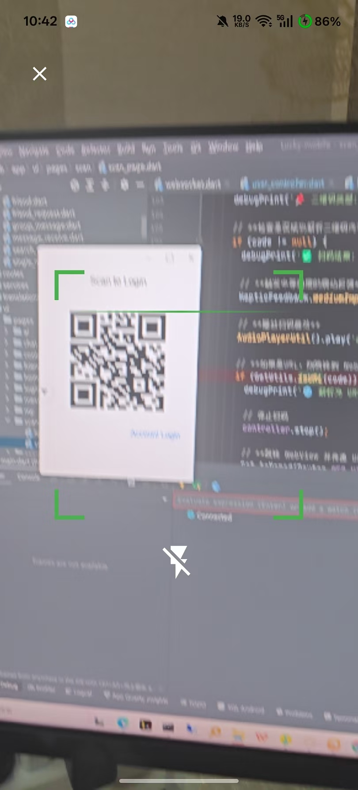

# 📱 Lucky - Flutter即时通讯(IM)应用


Lucky是一款基于Flutter开发的即时通讯(IM)应用，支持一对一聊天、群聊、音视频通话等功能。采用现代化的技术栈，提供了稳定、高效、安全的即时通讯解决方案。

## 🌟 主要特性

- 💬 即时消息：支持文字、图片、视频等多种消息类型
- 🎥 音视频通话：基于WebRTC的实时音视频通讯
- 📞 通讯录管理：好友添加、删除、黑名单等管理功能
- 🔐 安全加密：RSA加密算法保障消息传输安全
- 🌐 跨平台：一套代码支持Android和iOS平台
- 🌙 现代化UI：采用Material Design设计风格

## 🖼 项目预览

<table>
  <tr>
    <td align="center">
    
    </td>
    <td align="center">
      
    </td>
  </tr>
  <tr>
    <td align="center">
      
    </td>
    <td align="center">
      
    </td>
  </tr>
</table>

## 🛠 技术栈

- **框架**：[Flutter](https://flutter.dev/) + [GetX](https://pub.dev/packages/get)
- **状态管理**：[GetX](https://pub.dev/packages/get) + [Provider](https://pub.dev/packages/provider)
- **网络请求**：[Dio](https://pub.dev/packages/dio)
- **数据库**：[Floor](https://pub.dev/packages/floor) (SQLite ORM)
- **实时通讯**：WebSocket + [WebRTC](https://pub.dev/packages/flutter_webrtc)
- **本地存储**：[GetStorage](https://pub.dev/packages/get_storage) + [Flutter Secure Storage](https://pub.dev/packages/flutter_secure_storage)

## 📦 依赖功能

- 📸 相机和相册：[camera](https://pub.dev/packages/camera) + [image_picker](https://pub.dev/packages/image_picker)
- 🔐 权限管理：[permission_handler](https://pub.dev/packages/permission_handler)
- 📱 二维码扫描：[mobile_scanner](https://pub.dev/packages/mobile_scanner)
- 🎵 音频播放：[audioplayers](https://pub.dev/packages/audioplayers)
- 📺 视频播放：[video_player](https://pub.dev/packages/video_player)
- 🌍 WebView：[webview_flutter](https://pub.dev/packages/webview_flutter)

## 🚀 快速开始

### 环境要求

- Flutter SDK >=3.0.0 <4.0.0
- Dart SDK >=3.0.0 <4.0.0

### 安装依赖

```bash
flutter pub get
```

### 运行应用

```bash
flutter run
```

### 生成 ProtoBuf 

````bash
protoc -I=proto --dart_out=lib/proto proto/im_connect.proto google/protobuf/any.proto google/protobuf/struct.proto
````

## 📁 项目结构

```
lib/
├── app/
│   ├── api/          # API接口
│   ├── bindings/     # GetX依赖绑定
│   ├── controller/   # GetX控制器
│   ├── database/     # 数据库相关
│   ├── models/       # 数据模型
│   ├── routes/       # 路由配置
│   ├── services/     # 业务服务
│   ├── translations/ # 国际化
│   └── ui/           # 用户界面
│       ├── pages/    # 页面组件
│       └── widgets/  # 自定义组件
├── config/          # 配置文件
├── constants/       # 常量定义
└── utils/           # 工具类
```
## 📁 nignx 服务反代
````nginx
#user  nobody;
worker_processes  1;

#pid        logs/nginx.pid;

events {
    worker_connections  1024;
}


http {
    include       mime.types;
    default_type  application/octet-stream;
    sendfile      on;
    keepalive_timeout  65;

    server {
        # HTTPS 监听端口（默认 443 也可以自定义，如 9191）
        listen 9190 ssl;
        server_name  localhost;  # 修改为你的域名或 IP

        # 配置 SSL 证书和密钥文件路径
        ssl_certificate "D:/Program Files/Nginx/cert/localhost.crt"; 
        ssl_certificate_key "D:/Program Files/Nginx/cert/localhost.key"; # 配置密钥文件地址

        # 反向代理所有请求到后端 HTTP 接口
        location / {
            # 此处 backend_http_host 与 backend_http_port 请替换成后端实际的 IP 和端口，例如 http://127.0.0.1:8080
            proxy_pass http://localhost:9191;
            
            # 设置 HTTP 版本和必要的头部
            proxy_http_version 1.1;
            proxy_set_header Host $host;
            proxy_set_header X-Real-IP $remote_addr;
            proxy_set_header X-Forwarded-For $proxy_add_x_forwarded_for;
            # 通知后端使用 HTTPS 协议（虽然 Nginx 与后端之间使用 HTTP，但客户端为 HTTPS）
            proxy_set_header X-Forwarded-Proto https;
            proxy_set_header Upgrade $http_upgrade;
            proxy_set_header Connection "Upgrade";
            proxy_read_timeout 3600s;
        }
    }


	server {
        # HTTPS 监听端口（默认 443 也可以自定义，如 9191）
        listen 1980 ssl;
        server_name  localhost;  # 修改为你的域名或 IP

        # 配置 SSL 证书和密钥文件路径
        ssl_certificate "D:/Program Files/Nginx/cert/localhost.crt"; 
        ssl_certificate_key "D:/Program Files/Nginx/cert/localhost.key"; # 配置密钥文件地址

        location / {
           proxy_pass http://127.0.0.1:8080/;
		   proxy_http_version 1.1;
           proxy_set_header Host $host;
           proxy_set_header X-Real-IP $remote_addr;
        }

        location ~ /.+/.*\.(flv|m3u8|ts|aac|mp3)$ {
           proxy_pass http://127.0.0.1:8080$request_uri;
		   proxy_http_version 1.1;
           proxy_set_header Host $host;
           proxy_set_header X-Real-IP $remote_addr;
        }
   
        location /api/ {
           proxy_pass http://127.0.0.1:1985/api/;
		   proxy_http_version 1.1;
           proxy_set_header Host $host;
           proxy_set_header X-Real-IP $remote_addr;
        }
        
        location /rtc/ {
           proxy_pass http://127.0.0.1:1985/rtc/;
		   proxy_http_version 1.1;
           proxy_set_header Host $host;
           proxy_set_header X-Real-IP $remote_addr;
        }
    } 
}
````

## 🤝 贡献指南

我们欢迎所有形式的贡献！请查看 [CONTRIBUTING.md](CONTRIBUTING.md) 了解详情。

### 贡献方式

1. **Fork** 项目
2. 创建功能分支 (`git checkout -b feature/AmazingFeature`)
3. 提交更改 (`git commit -m 'Add some AmazingFeature'`)
4. 推送到分支 (`git push origin feature/AmazingFeature`)
5. 创建 **Pull Request**

### 开发交流

- 提交 Issue 报告问题或建议新功能
- 加入技术交流群讨论技术细节

## 📞 联系我们

- **项目主页**: [https://github.com/Luckly-XYZ](https://github.com/dennis9486/Lynk)

- **问题反馈**: [Issues](https://github.com/Luckly-XYZ/Lucky-mobile/issues)

- **邮箱**: 382192293@qq.com

  

## 📢 免责声明

本项目仅供学习和参考使用，不得用于任何商业用途。作者不对使用本项目可能引起的任何直接或间接损失承担责任。

1. 本项目是一个开源学习项目，旨在提供即时通讯技术的学习和研究参考。
2. 项目中涉及的技术方案、代码实现仅供参考，不保证其在生产环境中的稳定性、安全性和可靠性。
3. 用户在使用本项目时应自行承担所有风险，包括但不限于数据丢失、系统损坏、通信安全等问题。
4. 作者不提供任何形式的技术支持和保障，也不对项目的使用效果做任何承诺和保证。
5. 如将本项目用于商业用途，需自行承担可能的法律风险和责任。


## 💬 项目状态

本项目目前处于积极维护状态，持续更新和完善功能。

---

⭐ 如果这个项目对您有帮助，请给我们一个星标！
